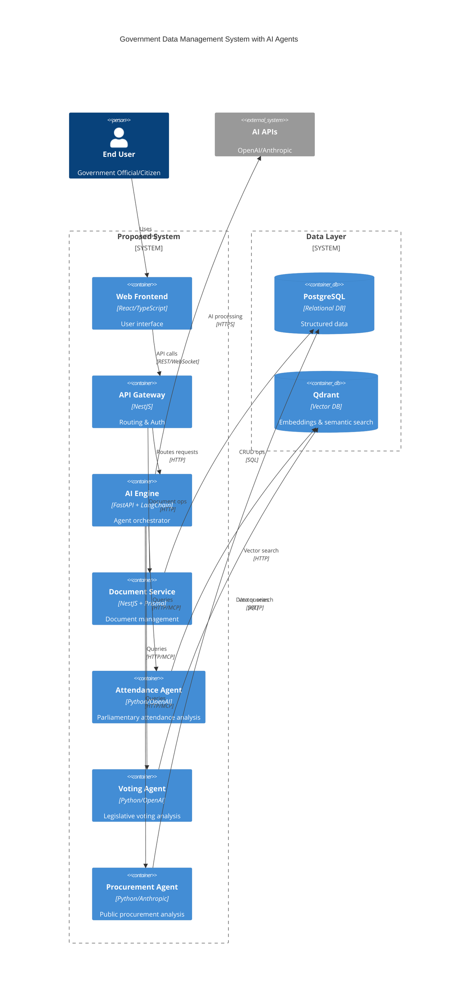

# Diagrama C4 de Contenedores - Sistema de Gestión Gubernamental

## IEEE Publication Version

## IEEE Article Description

### System Architecture

The proposed system implements a **microservices architecture** with **specialized AI agents** for government data analysis. The main components include:

**Presentation Layer:**

- **Web Frontend**: React/TypeScript interface for user interaction
- **API Gateway**: Single entry point with NestJS for routing and authentication

**Processing Layer:**

- **AI Engine**: FastAPI + LangChain-based orchestrator that coordinates multiple agents
- **Document Service**: NestJS microservice with Prisma for document administration

**Specialized Agents (MCP):**

- **Attendance Agent**: Parliamentary attendance data analysis
- **Voting Agent**: Legislative voting records processing
- **Procurement Agent**: Public procurement process analysis

**Data Layer:**

- **PostgreSQL**: Relational database for structured data
- **Qdrant**: Vector database for embeddings and semantic search

**External Services:**

- **AI APIs**: OpenAI GPT and Anthropic Claude for natural language processing

### Information Flow

1. User interacts with the web frontend
2. Requests are routed through the API Gateway
3. AI Engine orchestrates queries to specialized agents
4. Agents process domain-specific data using external AI APIs
5. Results are consolidated and presented to the user

This architecture enables **horizontal scalability**, **domain specialization**, and **distributed processing** of large volumes of government data.

---

## Versión Detallada (Referencia Técnica)

### Frontend

- **Tecnología**: React + TypeScript + Vite + TailwindCSS
- **Puerto**: 4000 (por defecto)
- **Función**: Interfaz de usuario web que permite a los usuarios interactuar con el sistema

### API Gateway

- **Tecnología**: NestJS + Socket.IO + NATS
- **Puerto**: 3000 (por defecto)
- **Función**: Punto de entrada único, manejo de WebSockets y routing

### Microservicio Chats

- **Tecnología**: FastAPI + LangChain + LangGraph
- **Puerto**: 8000 (por defecto)
- **Función**: Orquesta conversaciones con IA y coordina agentes especializados

### Microservicio Documentos

- **Tecnología**: NestJS + Prisma
- **Puerto**: 3001 (por defecto)
- **Función**: Gestión de documentos gubernamentales y metadatos

### Servidores MCP (Model Context Protocol)

- **MCP Asistencia** (Puerto 8003): Análisis de asistencia parlamentaria
- **MCP Votaciones** (Puerto 8001): Análisis de votaciones parlamentarias
- **MCP Contrataciones** (Puerto 8002): Análisis de contrataciones públicas

### Infraestructura

- **NATS Server**: Mensajería asíncrona entre microservicios
- **Nginx**: Servidor de archivos estáticos
- **PostgreSQL**: Bases de datos relacionales (3 instancias)
- **Qdrant**: Base de datos vectorial para búsquedas semánticas

### Servicios Externos

- **OpenAI API**: GPT y embeddings
- **Anthropic API**: Claude para análisis avanzado
- **Tavily API**: Búsqueda web especializada

## Puertos de Exposición

- Frontend: 4000
- Gateway: 3000
- MS-Chats: 8000
- MS-Documents: 3001
- MCP-Voting: 8001
- MCP-Procurement: 8002
- MCP-Attendance: 8003
- NATS: 4222, 8222
- Qdrant: 6333, 6334
- Nginx: 8080
- PostgreSQL DBs: 5532, 5632, 5732
