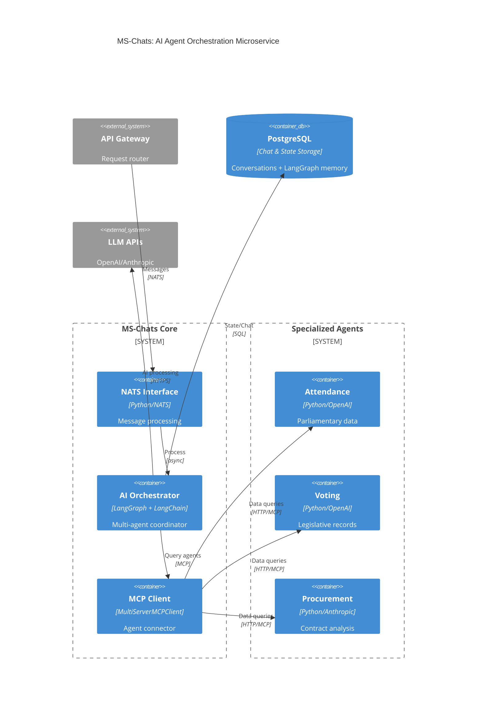

# C4 Container Diagram - MS-Chats Internal Architecture

## IEEE Publication Version

## IEEE Article Description

### MS-Chats Architecture Overview

The **MS-Chats microservice** serves as the **AI orchestration engine** within the government data management system. It implements a **multi-agent architecture** using LangGraph and LangChain frameworks to coordinate specialized AI agents for domain-specific analysis.

### Core Components

**1. NATS Interface**

- Handles asynchronous message processing from the API Gateway
- Manages request routing and response streaming
- Provides scalable message-driven communication

**2. AI Orchestrator**

- **LangGraph-based state machine** for complex multi-step reasoning
- **Multi-model coordination** with OpenAI GPT-4o and Anthropic Claude
- **Query optimization and classification** for intelligent routing
- **Conversation state management** with persistent memory

**3. MCP Client**

- **MultiServerMCPClient** for simultaneous agent connections
- **Model Context Protocol** implementation for standardized agent communication
- **Load balancing and fallback** mechanisms for high availability

### Specialized Agents Integration

The microservice connects to three **domain-specific agents**:

- **Attendance Agent**: Parliamentary attendance data analysis using OpenAI
- **Voting Agent**: Legislative voting records processing with OpenAI
- **Procurement Agent**: Public contract analysis powered by Anthropic Claude

### Data Flow

1. **Request Processing**: API Gateway → NATS → MS-Chats
2. **AI Coordination**: NATS Interface → AI Orchestrator → Query Processing
3. **Agent Orchestration**: AI Orchestrator → MCP Client → Specialized Agents
4. **Response Generation**: Agents → MCP Client → AI Orchestrator → Response
5. **State Persistence**: Conversation history and state stored in PostgreSQL

### Key Features

- **Asynchronous Processing**: Non-blocking operations for high concurrency
- **Multi-Agent Coordination**: Intelligent routing to appropriate specialists
- **Conversation Memory**: LangGraph checkpoints for context continuity
- **Streaming Support**: Real-time token-by-token response generation
- **Fault Tolerance**: Multi-model fallbacks and graceful degradation

This architecture enables **scalable AI orchestration** with **specialized domain expertise** through the standardized MCP protocol, providing government officials with intelligent access to complex parliamentary and procurement data.

---

## Detailed Technical Reference

### Request Flow Details

1. **Message Reception**: NATS handler receives structured messages from API Gateway
2. **Query Processing**: AI Orchestrator analyzes and optimizes user queries
3. **Agent Selection**: Dynamic routing to appropriate specialized agents based on query classification
4. **Response Coordination**: Aggregation and synthesis of multi-agent responses
5. **State Management**: Persistent conversation context using LangGraph memory

### Technology Stack

- **FastAPI**: Lightweight HTTP server for health checks
- **NATS**: Asynchronous message broker for microservice communication
- **LangGraph**: State machine framework for complex AI workflows
- **LangChain**: LLM abstraction and tool integration framework
- **PostgreSQL**: Dual-purpose storage for chat history and AI state checkpoints

### Scalability Features

- **Horizontal Scaling**: Stateless processing with external state storage
- **Connection Pooling**: Efficient database and MCP connection management
- **Async Processing**: Non-blocking I/O for high throughput
- **Resource Management**: Automatic cleanup and connection lifecycle management
